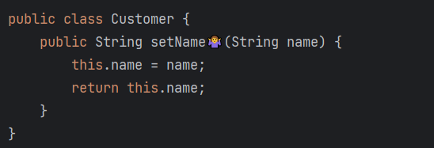
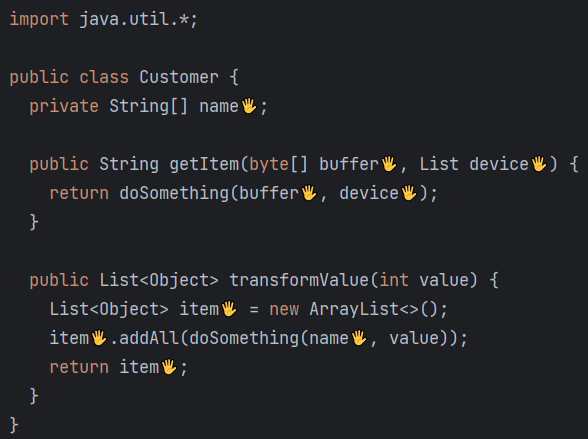
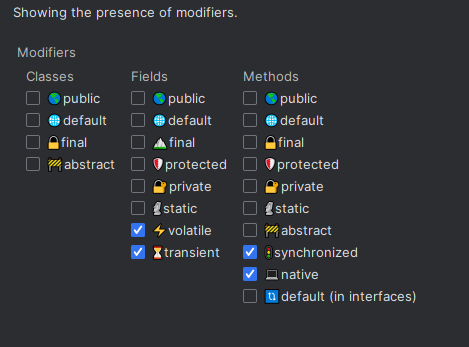

<!-- DESCRIPTION HEADER BEGIN -->

# codEEmoji Plugin

**codeEEmoji** is a plug-in made for Intellij Idea and useful for Java programming. The plugin defines new sets of inlay hints in the context of code
augmentation. The new inlay hints use emojis in an innovative way to help the developer. Emojis are displayed for anti-pattern cases such as naming
violations or bad programming practices. The plugin can also show emojis in the editor indicating the presence of modifiers for classes, fields,
methods, parameters or local variables that are being used. Likewise, the developer can indicate emojis to display for all these elements, according
to a rule, for example, for a class being instantiated that implements a specific interface, for a method being invoked that is annotated by a certain
annotation , a local variable of a given type, and so on. For the next version, in addition to emojis, the plugin will be able to show implicit
annotations for JakartaEE and Spring frameworks.

<!-- DESCRIPTION HEADER END -->

<!-- TOC -->
  * [Setup and Use](#setup-and-use)
    * [Prerequisites](#prerequisites)
    * [Installation via marketplace](#installation-via-marketplace)
    * [Manual installation](#manual-installation)
    * [How to configure](#how-to-configure)
  * [Cases of Naming Violation](#cases-of-naming-violation)
    * [Short Descriptive Name](#short-descriptive-name)
    * [Getter More Than Accessor](#getter-more-than-accessor)
    * [_Is_ Returns More Than a Boolean](#is-returns-more-than-a-boolean)
    * [Setter Method Returns](#setter-method-returns)
    * [Expecting But Not Getting a Single Instance](#expecting-but-not-getting-a-single-instance)
    * [Validation Method Does Not Confirm](#validation-method-does-not-confirm)
    * [Getter Does Not Return](#getter-does-not-return)
    * [Not Answered Question](#not-answered-question)
    * [Transform Method Does Not Return](#transform-method-does-not-return)
    * [Expecting But Not Getting a Collection](#expecting-but-not-getting-a-collection)
    * [Says One But Contains Many](#says-one-but-contains-many)
    * [Name Suggests Boolean By Type Does Not](#name-suggests-boolean-by-type-does-not)
    * [Says Many But Contains One](#says-many-but-contains-one)
    * [Name Contains Only Special Characters](#name-contains-only-special-characters)
  * [Cases of Showing Modifiers](#cases-of-showing-modifiers)
  * [Cases of Showing Specifics of Projects](#cases-of-showing-specifics-of-projects)
  * [Cases of Showing Implicit Annotations](#cases-of-showing-implicit-annotations)
  * [How to Extend](#how-to-extend)
  * [Acknowledgements](#acknowledgements)
  * [References](#references)
<!-- TOC -->

## Setup and Use

### Prerequisites

- [**IntelliJ IDEA 2023.***](https://www.jetbrains.com/idea/download/other.html) (Ultimate, Community or Educational)
- JDK 17 [(*Eclipse Temurin - as a suggestion*)](https://github.com/adoptium/temurin17-binaries/releases)

### Installation via marketplace

[JetBrains Marketplace - codEEmoji](https://plugins.jetbrains.com/plugin/22416-cod-emoji)

### Manual installation

- Download the latest release zip file available from [Releases](https://github.com/codeemoji/codeemoji-plugin/releases).

- Open Intellij IDEA and navigate to **_"File>Settings>Plugins"_** menu. Click on the gear icon and the "**_Install Plugin From Disk..._**" option.
  Select the downloaded zip file and click "**_OK_**".

- Restart IDE.

### How to configure

The plugin creates new Inlay Hints. All new inlay hints are enabled by default when installing the plugin. To disable inlay hints or configure
options that are available for each one, go to "**_File>Settings>Editor>Inlay Hints_**". Click "**_Other>Java_**".

## Cases of Naming Violation

### Short Descriptive Name

Instead of a descriptive name, the variable's name consists of a few letters.

**Configuration options:** Number of letters

_**Impacted identifiers: Fields, Method Parameters and Local Variables**_

### Getter More Than Accessor

A getter that doesn't just return the corresponding attribute but also takes other actions. Adapted from Arnaoudova et al.(2016).

_**Impacted identifiers: Method Names**_

### _Is_ Returns More Than a Boolean

A method's name is a predicate that denotes a true/false value that will be returned. The return type, however, is a more complex type than boolean.
Adapted from Arnaoudova et al.(2016).

_**Impacted identifiers: Method Names**_

### Setter Method Returns

A setter method that has a return type other than void. Adapted from Arnaoudova et al.(2016).

_**Impacted identifiers: Method Names**_

### Expecting But Not Getting a Single Instance

Despite the fact that a method's name suggests it will return a single object, it will actually return a collection. Adapted from Arnaoudova et al.(
2016).

_**Impacted identifiers: Method Names**_

### Validation Method Does Not Confirm

A validation method (such as one with the words <em>validate,</em> <em>check,</em> or <em>ensure</em>) does not confirm the validation; that is, it
neither provides a return value indicating whether the validation was successful. Adapted from Arnaoudova et al.(2016).

_**Impacted identifiers: Method Names**_

### Getter Does Not Return

When a method's name begins with <em>get</em> or <em>return</em>, for example, it might be assumed that it returns something, but the return type is
actually void. Adapted from Arnaoudova et al.(2016).

_**Impacted identifiers: Method Names**_

### Not Answered Question

A method's name takes the form of a predicate, but its return type is not boolean. Adapted from Arnaoudova et al.(2016).

_**Impacted identifiers: Method Names**_

### Transform Method Does Not Return

While there is no return value, a method's name implies that an object has been transformed. Adapted from Arnaoudova et al.(2016).

_**Impacted identifiers: Method Names**_

### Expecting But Not Getting a Collection

Even though a method's name suggests a collection should be returned, nothing or just one object is instead given. Adapted from Arnaoudova et al.(
2016).

_**Impacted identifiers: Method Names**_

### Says One But Contains Many

An attribute's type suggests that it stores a collection of objects, contrary to the name, which suggests a single instance. Adapted from Peruma et
al.(2021).

_**Impacted identifiers: Fields, Method Parameters and Local Variables**_

### Name Suggests Boolean By Type Does Not

An attribute's name implies that its value is true or false, yet its defining type is not boolean. Adapted from Arnaoudova et al.(2016).

_**Impacted identifiers: Fields, Method Parameters and Local Variables**_

### Says Many But Contains One

The name of an attribute suggests multiple instances, but its type suggests a single one. Adapted from Arnaoudova et al.(2016).

_**Impacted identifiers: Fields, Method Parameters and Local Variables**_

### Name Contains Only Special Characters

The identifier's name is made up entirely of non-alphanumeric characters. Adapted from Arnaoudova et al.(2016).

_**Impacted identifiers: Fields, Method Parameters and Local Variables**_

## Cases of Showing Modifiers

This inlay hint allows you to configure the display of emojis for class, field and method modifiers. Emojis are displayed when an element is used in the code, indicating its modifiers. The figure below shows the configuration screen with the options enabled during installation. Then a code snippet is displayed, where all options have been enabled.

_**Impacted identifiers: Classes, Fields and Methods**_

## Cases of Showing Specifics of Projects

This inlay hint is displayed according to the specifics of the project. It must be configured by the developer from a file in the root of the 
project named *"codeemoji.json"*. It allows indicating rules for displaying emojis according to specific features for each element, as follows:

- Element: Class
  - Features: Annotations, Extends and Implements
- Element: Field
  - Features: Annotations, Types
- Element: Method
  - Features: Annotations, Returns
- Element: Parameter
  - Features: Annotations, Types
- Element: Local Variable
  - Features: Annotations, Types

For each element, it is possible to optionally indicate an emoji from the [unicode sequence](https://unicode.org/Public/emoji/15.0/emoji-sequences.txt) that represents it. The *"codeemoji.json"* file follows 
a simple description pattern, as shown in the following a partial example:

Complete example [here](docs/codeemoji.json).

In the configuration screen of this inlay hint, the rules currently defined for the open project are displayed. See the following figure.

Here's an example of usage from a code snipped:

## Cases of Showing Implicit Annotations

Coming soon...

## How to Extend

Coming soon...

## Acknowledgements

This work was supported by the **Free University of Bozen-Bolzano - UNIBZ**.

## References

Arnaoudova, Venera, Massimiliano Di Penta, and Giuliano Antoniol. "Linguistic antipatterns: What they are and how mainers perceive them."
_Empirical Software Engineering_ 21 (2016): 104-158.

